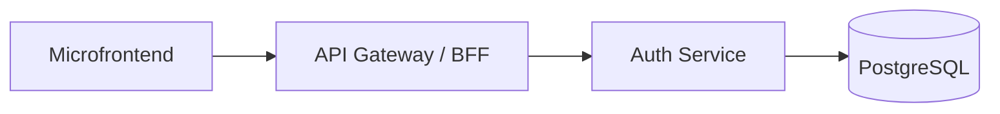
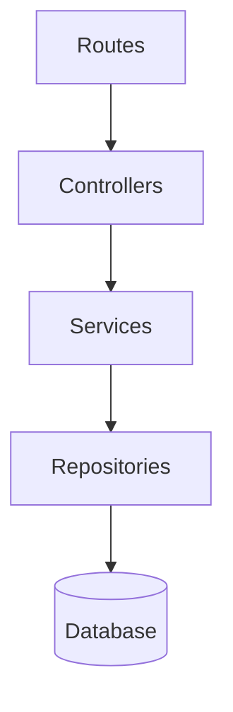
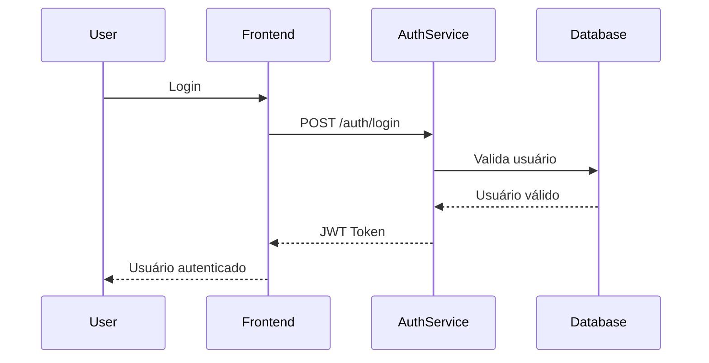
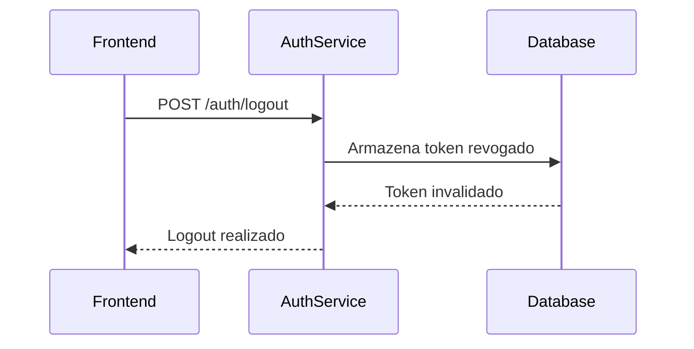
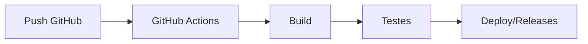

# ADR-001 — Arquitetura do Microsserviço de Autenticação


---

# Informações Gerais

| Campo | Valor |
|---|---|
| ADR | ADR-001 |
| Título | Arquitetura do Microsserviço de Autenticação |
| Status | Aceito |
| Disciplina | Engenharia de Software II |
| Projeto | Sistema de Autoavaliação de Competências |
| Grupo | G7 |
| Repositório | https://github.com/pucrs-sweii-2026-1-31/chave-ms-auth-g7 |

---

# Integrantes

| Componentes do Grupo G7 |
|---|
| Ana Carolina Bregolin Bertuzzo |
| Bruna Marschner |
| Cristiano José Ferrazzo |
| João Paulo da Rocha Camargos Carneiro |
| Marcelo Slaviero da Silva |
| Rodrigo Pires dos Santos |

---

# Contexto

O projeto da disciplina de Engenharia de Software II consiste no desenvolvimento de um sistema distribuído para autoavaliação de competências voltado para pessoas idosas, utilizando arquitetura baseada em microsserviços e microfrontends.

A primeira entrega (P1) exige:

- autenticação/autorização;
- microsserviço;
- microfrontend;
- pipelines CI/CD;
- testes unitários;
- documentação Swagger;
- ADR;
- containerização.

O grupo ficou responsável pelo desenvolvimento do microsserviço de autenticação do sistema.

---

# Objetivo

Desenvolver um serviço centralizado de autenticação e autorização responsável por:

- autenticar usuários;
- emitir tokens JWT;
- validar sessões;
- controlar permissões;
- fornecer gerenciamento de usuários;
- permitir integração com os demais microsserviços da solução.

---

# Decisão Arquitetural

Foi adotada uma arquitetura baseada em microsserviços utilizando:

- Node.js;
- Express.js;
- TypeScript;
- PostgreSQL;
- TypeORM;
- JWT;
- Docker;
- Swagger/OpenAPI;
- GitHub Actions.

O serviço foi implementado como um microsserviço independente responsável pela autenticação centralizada do sistema.

---

# Arquitetura da Solução

## Visão Geral



---

## Estrutura Interna do Microsserviço



---

# Fluxo de Autenticação

## Fluxo JWT



---

## Fluxo de Logout com Blocklist



---

# Estrutura do Projeto

```text
src/
├── app/
│   ├── controllers/
│   │   ├── AuthController.ts          # Controla as rotas de autenticação: login, logout e usuário autenticado
│   │   └── UsersController.ts         # Controla as rotas de usuários: cadastro, listagem, atualização e gestão de roles
│   │
│   ├── entities/
│   │   ├── Users.ts                   # Entidade TypeORM da tabela users
│   │   ├── Roles.ts                   # Entidade TypeORM da tabela roles
│   │   └── RevokedToken.ts            # Entidade TypeORM da tabela revoked_tokens, usada para blocklist de JWT
│   │
│   ├── interfaces/
│   │   ├── iUsers.ts                  # Interfaces e tipos relacionados aos usuários
│   │   └── iRoles.ts                  # Interfaces e tipos relacionados aos perfis/papéis de acesso
│   │
│   ├── middlewares/
│   │   ├── authMiddleware.ts          # Valida Bearer Token, verifica expiração e consulta blocklist
│   │   ├── rateLimiter.ts             # Define limites de requisições para reduzir abuso nas rotas sensíveis
│   │   └── errorHandler.ts            # Middleware global para padronização de erros da API
│   │
│   ├── repositories/
│   │   ├── UserRepository.ts          # Camada de acesso aos dados de usuários
│   │   ├── RoleRepository.ts          # Camada de acesso aos dados de roles/perfis
│   │   └── RevokedTokenRepository.ts  # Camada de acesso aos tokens revogados
│   │
│   ├── routes/
│   │   └── Routes.ts                  # Centraliza o registro das rotas da aplicação
│   │
│   └── services/
│       ├── AuthService.ts             # Regras de autenticação: login, geração de JWT e revogação de token
│       └── UsersService.ts            # Regras de negócio de usuários: cadastro, atualização e gestão de permissões
│
├── database/
│   └── database-config.ts             # Configuração do DataSource do TypeORM e conexão com PostgreSQL
│
├── server.ts                          # Ponto de entrada da aplicação; inicializa o servidor HTTP
└── swagger.ts                         # Configuração da documentação Swagger/OpenAPI
```

---

# Organização da Arquitetura

A estrutura do projeto foi organizada em camadas para separar responsabilidades e facilitar manutenção, testes e evolução do microsserviço.

A camada `controllers` recebe as requisições HTTP e encaminha para os serviços.

A camada `services` concentra as regras de negócio, como autenticação, emissão de JWT, revogação de tokens e gestão de usuários.

A camada `repositories` isola o acesso ao banco de dados.

As `entities` representam as tabelas persistidas via TypeORM.

Os `middlewares` tratam responsabilidades transversais, como autenticação, limitação de requisições e tratamento global de erros.

A pasta `database` centraliza a configuração da conexão com o PostgreSQL.

---

# Decisões Técnicas

## 1. Uso de Microsserviços

### Decisão

Separação da autenticação em um serviço independente.

### Motivação

- desacoplamento;
- reutilização;
- escalabilidade;
- independência de deploy;
- facilidade de manutenção.

---

## 2. Uso de JWT

### Decisão

Utilização de JWT para autenticação.

### Motivação

- comunicação stateless;
- integração simples entre serviços;
- padrão amplamente utilizado;
- facilidade de escalabilidade.

---

## 3. Uso de Blocklist

### Decisão

Implementação de revogação de tokens via blocklist.

### Motivação

Permitir logout efetivo mesmo utilizando JWT.

### Benefícios

- aumento de segurança;
- invalidação de sessões;
- revogação de tokens comprometidos.

---

## 4. Uso de PostgreSQL

### Decisão

Banco de dados relacional PostgreSQL.

### Motivação

- confiabilidade;
- suporte transacional;
- integração com TypeORM;
- estabilidade.

---

## 5. Uso de TypeScript

### Decisão

Desenvolvimento utilizando TypeScript.

### Motivação

- tipagem estática;
- redução de erros;
- melhor manutenção;
- maior segurança de código.

---

## 6. Uso de Docker

### Decisão

Containerização do serviço.

### Motivação

- padronização de ambiente;
- facilidade de execução;
- integração futura com cloud;
- simplificação do deploy.

---

# CI/CD

## Pipeline adotado

O projeto utiliza GitHub Actions para integração contínua.

### Etapas do pipeline

- checkout do repositório;
- instalação de dependências;
- build da aplicação;
- execução de testes;
- validação automatizada.

---

## Fluxo CI/CD



---

# Endpoints Principais

| Método | Endpoint | Descrição |
|---|---|---|
| POST | /auth/login | Realiza login |
| POST | /auth/logout | Realiza logout |
| GET | /auth/me | Usuário autenticado |
| POST | /users/sign-up | Cadastro de usuário |
| GET | /users/all | Lista usuários |
| PUT | /users/save | Atualiza usuário |

---

# Consequências

## Consequências Positivas

| Benefício | Descrição |
|---|---|
| Escalabilidade | Serviço pode crescer independentemente |
| Desacoplamento | Separação clara de responsabilidades |
| Segurança | JWT + blocklist |
| Reutilização | Serviço compartilhado entre microsserviços |
| Padronização | Arquitetura moderna |
| Portabilidade | Docker facilita execução |

---

## Consequências Negativas

| Impacto | Descrição |
|---|---|
| Complexidade | Arquitetura distribuída |
| Infraestrutura | Mais serviços para gerenciar |
| Comunicação | Dependência entre serviços |
| Segurança | Necessidade de gerenciar tokens revogados |

---

# Alternativas Consideradas

## Sessão Tradicional

### Motivo da rejeição

- baixa escalabilidade;
- dependência de sessão centralizada;
- inadequado para microsserviços.

---

## Monólito

### Motivo da rejeição

- menor desacoplamento;
- baixa flexibilidade;
- não aderente ao escopo da disciplina.

---

# Tecnologias

| Tecnologia | Finalidade |
|---|---|
| Node.js | Runtime backend |
| Express.js | Framework HTTP |
| TypeScript | Linguagem principal |
| PostgreSQL | Banco de dados |
| TypeORM | ORM |
| JWT | Autenticação |
| Swagger | Documentação |
| Docker | Containerização |
| GitHub Actions | CI/CD |

---

# Conclusão

A arquitetura adotada atende aos requisitos da disciplina e fornece uma base sólida para evolução do sistema distribuído.

A utilização de microsserviços, JWT, Docker e CI/CD permite:

- escalabilidade;
- desacoplamento;
- facilidade de manutenção;
- segurança;
- integração entre serviços;
- padronização do desenvolvimento.

O microsserviço de autenticação torna-se o componente central de identidade do ecossistema da aplicação.

---

# Referências

- Node.js Documentation
- Express.js Documentation
- PostgreSQL Documentation
- Swagger/OpenAPI Specification
- Docker Documentation
- JWT.io
- GitHub Actions Documentation
- Material da disciplina Engenharia de Software II